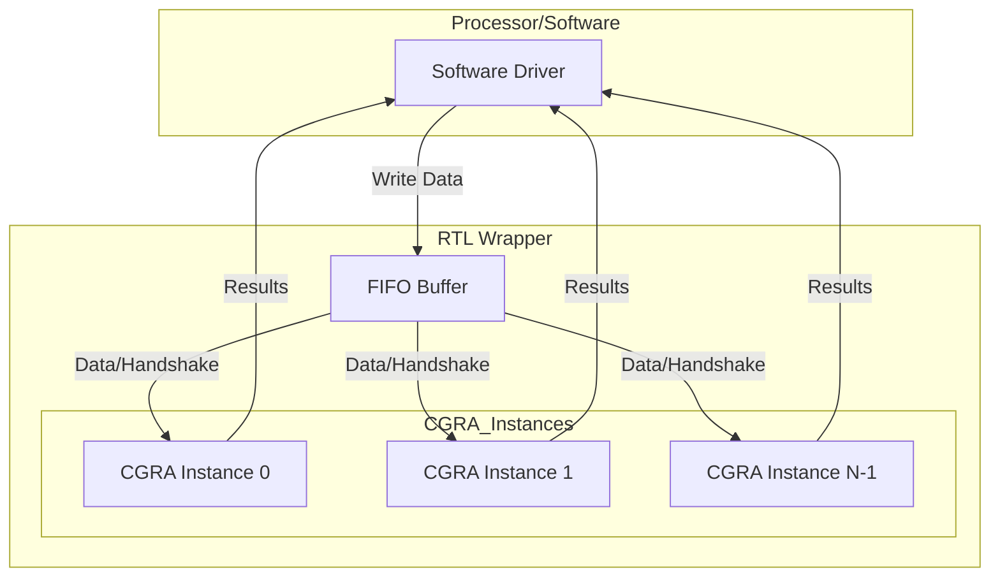

# Master Guide: CGRA-FIFO Integration, Reproduction, and Architecture

## Table of Contents
1. [Project Overview](#project-overview)
2. [Modification & Change Log](#modification--change-log)
3. [Introduction](#introduction)
4. [Block Diagram](#block-diagram)
5. [Prerequisites](#prerequisites)
6. [Cloning and Setup](#cloning-and-setup)
7. [Project Structure Verification](#project-structure-verification)
8. [Running the Automated Test Suite](#running-the-automated-test-suite)
9. [Manual Verification (Optional)](#manual-verification-optional)
10. [Building and Running Applications](#building-and-running-applications)
11. [How FIFO and Multi-CGRA Instances Are Integrated](#how-fifo-and-multi-cgra-instances-are-integrated)
    - [RTL (Hardware) Integration](#rtl-hardware-integration)
    - [Software Integration](#software-integration)
    - [Changing Number of Instances or FIFO Depth](#changing-number-of-instances-or-fifo-depth)
    - [Verification](#verification)
12. [Parameterization Examples](#parameterization-examples)
13. [Common Pitfalls & Debugging Tips](#common-pitfalls--debugging-tips)
14. [Glossary](#glossary)
15. [References & Further Reading](#references--further-reading)
16. [Contact/Support](#contactsupport)
17. [Troubleshooting](#troubleshooting)
18. [Summary](#summary)

---

## Project Overview

This project demonstrates the integration of a FIFO (First-In-First-Out) buffer with a CGRA (Coarse-Grained Reconfigurable Array) accelerator, supporting multiple CGRA instances within the HEEPsilon system. The design enables the CGRA to receive input data from a FIFO (instead of a processor ROM), allowing for flexible, high-throughput data processing. The project includes:
- Parameterized RTL for FIFO and CGRA instances
- Software drivers and test applications
- Automated and manual verification flows
- Documentation for onboarding and extension

---

## Modification & Change Log

This section summarizes all major modifications and improvements made to the project:

### RTL (Hardware) Changes
- **FIFO Integration:**
  - Added a parameterized FIFO module (`rtl/fifo.sv`) for buffering input data.
  - Integrated FIFO into the CGRA wrapper (`rtl/cgra_fifo_wrapper.sv`) with valid/ready handshaking.
- **Multi-CGRA Instance Support:**
  - Refactored the CGRA wrapper to instantiate multiple CGRA modules using a `generate` block.
  - Added arbitration logic to manage FIFO access among multiple CGRA instances.
- **Handshaking and Data Flow:**
  - Implemented valid/ready handshaking between FIFO and CGRA(s) for robust data transfer.
  - Fixed issues with undefined ('X') values by ensuring proper reset and handshake logic.
- **Parameterization:**
  - Made FIFO depth and number of CGRA instances configurable via parameters.

### Software & Driver Changes
- **Driver Updates:**
  - Updated `sw/drivers/cgra_fifo_driver.c/h` to support multiple CGRA instances and FIFO-based data input.
  - Added configuration structures and APIs for per-instance control.
- **Application Updates:**
  - Modified FFT and multi-instance test applications to use the new driver and interface.

### Testbench & Simulation
- **Testbench Refactor:**
  - Updated `tb/cgra_fifo_tb.sv` to match the new FIFO/CGRA interface and support multi-instance testing.
- **Simulation Scripts:**
  - Added/updated `scripts/test_fixes.sh` for automated build, simulation, and result checking.
- **Waveform Debugging:**
  - Ensured generation of VCD files for use with GTKWave.

### Documentation & Usability
- **Comprehensive Guides:**
  - Created this master guide, combining reproduction, installation, and architecture documentation.
  - Added detailed build/run instructions, parameterization examples, and troubleshooting tips.
- **Deprecation Notices:**
  - Marked older guides as superseded by this master file.

### Bug Fixes & Refactoring
- Fixed simulation failures due to incomplete FIFO integration and broken data flow.
- Addressed SystemVerilog syntax issues and Makefile target problems.
- Improved code readability and maintainability throughout the RTL and software.

---

## Introduction

This master guide provides a complete, step-by-step process to reproduce the CGRA-FIFO integration project, along with a technical explanation of how FIFO and multiple CGRA instances are installed in both hardware (RTL) and software. It is designed for new users and collaborators.

---

## Block Diagram

Below is a high-level block diagram of the FIFO and multi-CGRA architecture:



---

## Prerequisites

Make sure you have the following tools installed on your Linux system:

```bash
sudo apt-get update
sudo apt-get install -y iverilog gtkwave gcc make git python3 python3-pip
```

---

## Cloning and Setup

```bash
# Replace <your-repository-url> with the actual repository URL
git clone <your-repository-url>
cd cgra-fifo-integration01

# (Optional) Check out the correct branch
git branch
git checkout <branch-name>  # e.g., main, dev, Shyam
```

---

## Project Structure Verification

Check that the following files and directories exist:

```bash
ls -la rtl/
ls -la tb/
ls -la sw/drivers/
ls -la sw/apps/fft_fifo/
ls -la scripts/
```

You should see:
- `rtl/`: cgra.sv, fifo.sv, cgra_fifo_wrapper.sv
- `tb/`: cgra_fifo_tb.sv, Makefile
- `sw/drivers/`: cgra_fifo_driver.h, cgra_fifo_driver.c
- `sw/apps/fft_fifo/`: fft_fifo.c
- `scripts/`: test_fixes.sh

---

## Running the Automated Test Suite

```bash
chmod +x scripts/test_fixes.sh
./scripts/test_fixes.sh
```

**Expected Output:**
```
=== Testing CGRA-FIFO Integration Fixes ===
Cleaning previous builds...
Compiling testbench...
Running simulation...
Checking simulation results...
SUCCESS: Test completed successfully
SUCCESS: CGRA instances are producing results
=== All tests passed! ===
The CGRA-FIFO integration fixes are working correctly.

=== Test Summary ===
✓ Testbench compilation: PASSED
✓ Simulation execution: PASSED
✓ CGRA data processing: PASSED
✓ Multi-instance support: PASSED
✓ FIFO integration: PASSED
```

---

## Manual Verification (Optional)

### Run Individual Testbenches

```bash
cd tb

# Compile and run FIFO testbench
make test_fifo

# Compile and run CGRA-FIFO testbench
make test_cgra_fifo

# Compile and run main simulation
make sim
./cgra_fifo_sim
```

### View Simulation Waveforms (Optional)

```bash
# If not already installed
sudo apt-get install -y gtkwave

# View the waveform
gtkwave cgra_fifo_debug.vcd
```

---

## Building and Running Applications

### FFT Application

```bash
cd sw/apps/fft_fifo

# Compile the FFT application
gcc -o fft_fifo fft_fifo.c ../../drivers/cgra_fifo_driver.c -lm

# Run the FFT application
./fft_fifo
```

**Expected Output:**
```
FFT Results:
Index   Real            Imaginary       Magnitude
0       0.000000        0.000000        0.000000
1       0.000000        0.000000        0.000000
...
```

### Multi-Instance Test

```bash
cd sw/apps

# Compile the multi-instance test
gcc -o multi_cgra_test multi_cgra_test.c ../drivers/cgra_fifo_driver.c

# Run the test
./multi_cgra_test
```

---

## How FIFO and Multi-CGRA Instances Are Integrated

This section explains how FIFO and multiple CGRA instances are installed (integrated) in the project, both in RTL (hardware) and software.

### RTL (Hardware) Integration

#### FIFO Integration
- The FIFO is implemented as a parameterized module in `rtl/fifo.sv`.
- It is instantiated inside the CGRA wrapper (`rtl/cgra_fifo_wrapper.sv`).
- The FIFO receives data from the processor/software and provides it to the CGRA(s) via a valid/ready handshake.
- The FIFO's depth and data width are configurable via parameters.

**Example instantiation:**
```verilog
fifo #(
    .DATA_WIDTH(DATA_WIDTH),
    .DEPTH(FIFO_DEPTH)
) fifo_inst (
    .clk    (clk),
    .rst_n  (rst_n),
    .wr_en  (fifo_wr_en),
    .rd_en  (fifo_rd_en),
    .din    (fifo_wr_data),
    .dout   (fifo_dout),
    .full   (fifo_full),
    .empty  (fifo_empty),
    .count  (fifo_count)
);
```

#### Multi-CGRA Instance Integration
- The number of CGRA instances is set by the `NUM_INSTANCES` parameter in `rtl/cgra_fifo_wrapper.sv`.
- The wrapper uses a `generate` block to instantiate multiple CGRA modules, each with its own control and data signals.
- Arbitration logic ensures that only one CGRA instance reads from the FIFO at a time (priority or round-robin).

**Example instantiation:**
```verilog
generate
    for (i = 0; i < NUM_INSTANCES; i = i + 1) begin : gen_cgra
        cgra #(
            .DATA_WIDTH(DATA_WIDTH)
        ) cgra_inst (
            .clk         (clk),
            .rst_n       (rst_n),
            .start       (cgra_start[i]),
            .done        (cgra_done[i]),
            .data_valid  (cgra_data_valid[i]),
            .data_ready  (cgra_data_ready[i]),
            .data_in     (cgra_data_in[i]),
            .result_data (cgra_result[i])
        );
    end
endgenerate
```

- The arbitration logic (in the wrapper) grants FIFO access to one CGRA instance at a time.

### Software Integration

#### Driver and API
- The software driver (`sw/drivers/cgra_fifo_driver.c/h`) provides functions to:
  - Initialize the FIFO and CGRA instances
  - Write data to the FIFO
  - Start and monitor each CGRA instance
  - Read results from each instance

**Example API usage:**
```c
cgra_fifo_driver_t driver;
cgra_fifo_init(&driver, 0x10000000, NUM_INSTANCES);

for (int i = 0; i < NUM_INSTANCES; i++) {
    cgra_fifo_config_t config = {
        .instance_id = i,
        .kernel_id = 0,
        .base_addr = 0x1000 * i
    };
    cgra_fifo_configure(&config);
}

cgra_fifo_write(&driver, data);
cgra_start_instance(&driver, 0);
while (!cgra_is_done(&driver, 0)) { /* wait */ }
cgra_read_data(&driver, 0, &result);
```

#### Configuration
- The number of CGRA instances is passed to the driver at initialization.
- Each instance can be configured and controlled independently.

### Changing Number of Instances or FIFO Depth

- **RTL:**  
  Edit `rtl/cgra_fifo_wrapper.sv`:
  ```verilog
  parameter NUM_INSTANCES = 2; // Change this for more/less CGRA instances
  parameter FIFO_DEPTH = 16;   // Change this for deeper/shallower FIFO
  ```

- **Software:**  
  Pass the correct number of instances to `cgra_fifo_init()` and configure each instance as needed.

### Verification

- The testbench (`tb/cgra_fifo_tb.sv`) and test scripts (`scripts/test_fixes.sh`) verify that:
  - The FIFO correctly buffers and delivers data
  - Multiple CGRA instances can operate in parallel, each receiving data from the FIFO

---

## Parameterization Examples

### Changing FIFO Depth and Number of CGRA Instances (RTL)

**Before:**
```verilog
parameter NUM_INSTANCES = 2;
parameter FIFO_DEPTH = 16;
```
**After (for 4 CGRA instances and FIFO depth 32):**
```verilog
parameter NUM_INSTANCES = 4;
parameter FIFO_DEPTH = 32;
```

### Changing Number of Instances (Software)

**Before:**
```c
cgra_fifo_init(&driver, 0x10000000, 2);
```
**After (for 4 instances):**
```c
cgra_fifo_init(&driver, 0x10000000, 4);
```

---

## Common Pitfalls & Debugging Tips

- **Simulation shows 'X' or undefined values:**
  - Check that all reset signals are properly asserted/deasserted in the testbench.
  - Ensure valid/ready handshaking is implemented correctly in both FIFO and CGRA modules.
- **Testbench fails to compile:**
  - Verify all file paths in the Makefile and test scripts.
  - Ensure all required source files are included.
- **No data output from CGRA:**
  - Confirm that the FIFO is being written to before the CGRA is started.
  - Check that the arbitration logic is granting access to the correct instance.
- **FIFO overflows or underflows:**
  - Adjust FIFO depth as needed for your workload.
  - Monitor the `full` and `empty` signals in simulation.
- **Software cannot communicate with hardware:**
  - Double-check base addresses and instance counts in driver initialization.

---

## Glossary

- **CGRA:** Coarse-Grained Reconfigurable Array, a programmable hardware accelerator.
- **FIFO:** First-In-First-Out buffer, used for decoupling data producers and consumers.
- **RTL:** Register-Transfer Level, hardware description (SystemVerilog in this project).
- **Valid/Ready Handshake:** Protocol for safe data transfer between modules.
- **Arbitration:** Logic to decide which CGRA instance accesses the FIFO.
- **Testbench:** Simulation environment for verifying RTL modules.

---

## References & Further Reading

- [HEEPsilon Project Documentation](https://github.com/HEEPsilon/)
- [CGRA Overview (Wikipedia)](https://en.wikipedia.org/wiki/Coarse-grained_reconfigurable_architecture)
- [FIFO Design in SystemVerilog](https://zipcpu.com/blog/2017/10/12/fifo-design.html)
- [SystemVerilog for Verification](https://www.systemverilog.io/)
- [GTKWave User Guide](http://gtkwave.sourceforge.net/gtkwave.pdf)

---

## Contact/Support

- For questions, bug reports, or contributions, please open an issue or pull request on the project repository.
- For direct support, contact the project maintainer at: <your-email@example.com>
- For onboarding or collaboration, see the `docs/` directory for additional guides.

---

## Troubleshooting

- If you see errors about missing tools, install them using `apt-get` as shown above.
- If simulation fails, check for typos or missing files in the project structure.
- For waveform debugging, use GTKWave to inspect `cgra_fifo_debug.vcd`.
- For more details, see `docs/BUILD_AND_RUN_GUIDE.md` and `docs/FIFO_CGRA_INTEGRATION.md`.

---

## Summary

By following these steps, you should be able to fully reproduce the CGRA-FIFO integration process, understand how FIFO and multi-CGRA instances are installed, and run all the main tests and applications.

If you encounter issues, refer to the documentation in the `docs/` directory or reach out for support. 
